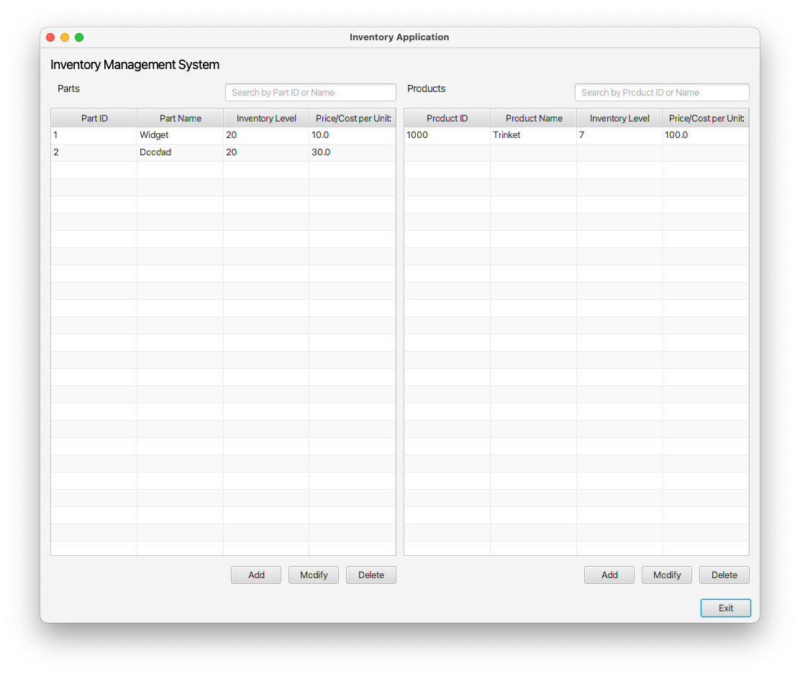
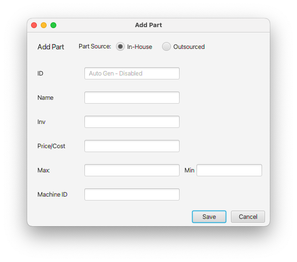
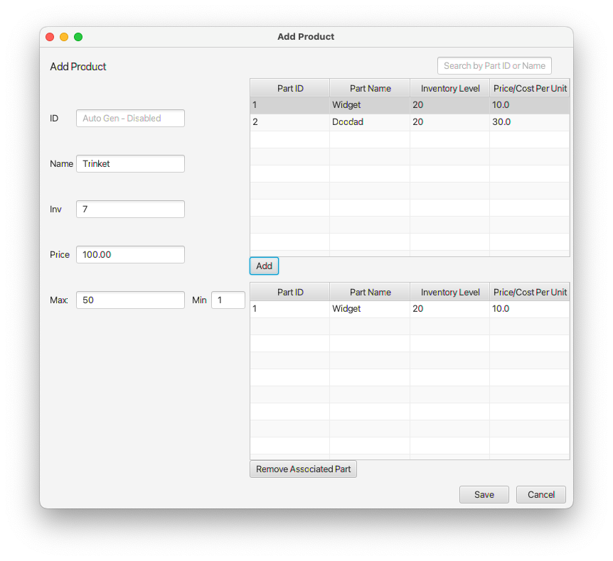
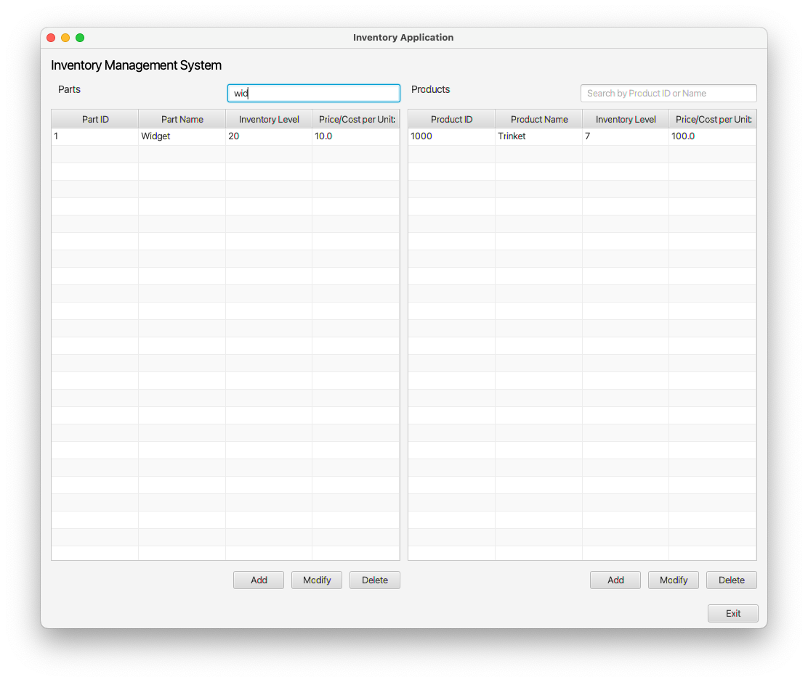

# Inventory Management System

## Overview

This Inventory Management System is a Java application that enables users to manage and track parts and products within a company's inventory. Equipped with a graphical user interface (GUI), the system provides functionalities for adding, modifying, and deleting inventory items.

## Major Features

- **Manage Parts**: Add, modify, and delete parts in the inventory. Supports both in-house and outsourced parts with unique identifiers.
- **Manage Products**: Create products composed of multiple parts and manage their details within the inventory.
- **Validation**: Enforces logical constraints to ensure the integrity of inventory data, such as prohibiting the deletion of a product that has parts associated with it.
- **Search Functionality**: Offers a search feature to quickly locate parts and products within the inventory.

## Programming Concepts

- **Object-Oriented Programming Applied**: The application is built with core principles of object-oriented programming to enhance modularity, reusability, and clarity:
  - **Encapsulation**: Defines classes with private fields and public methods, protecting data integrity and allowing for internal changes without affecting the class's external interface.
  - **Inheritance**: Demonstrates hierarchical class relationships through "In-House" and "Outsourced" parts, both extending a common `Part` base class, promoting code reuse and reducing redundancy.
  - **Polymorphism**: Employs method overriding and interface-based design, allowing objects of different classes to be treated as objects of a common superclass, which simplifies interactions with parts and products.
  - **Abstraction**: Abstracts complex operations into simple interface methods, hiding the implementation details and simplifying the system's interaction model for both users and developers.
- **JavaFX for UI**: Utilizes JavaFX to build a user-friendly graphical user interface.
- **Model-View-Controller (MVC) Architecture**: Adheres to the MVC design pattern to separate the application logic from the UI.
- **Exception Handling**: Incorporates exception handling to manage runtime errors and provide user feedback.
- **JavaDocs Documentation**: Utilizes JavaDocs to thoroughly document the codebase, ensuring clarity and ease of maintenance with detailed class and method descriptions accessible through generated HTML pages.

## Screenshots

    
     <b>Figure 1.</b> Main Menu

---

    
     <b>Figure 2.</b> Add Part Form

---

    
     <b>Figure 3.</b> Add Product Form

---

    
     <b>Figure 4.</b> Search Functionality

